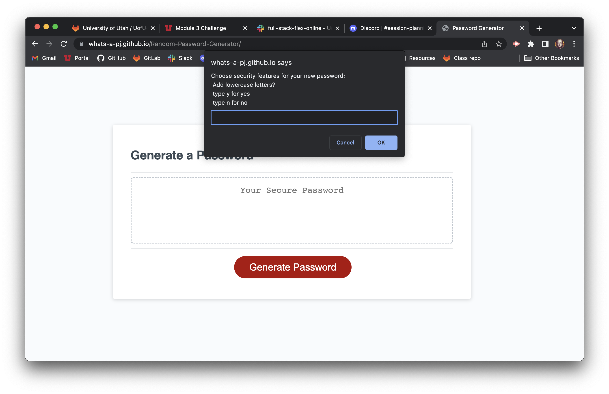
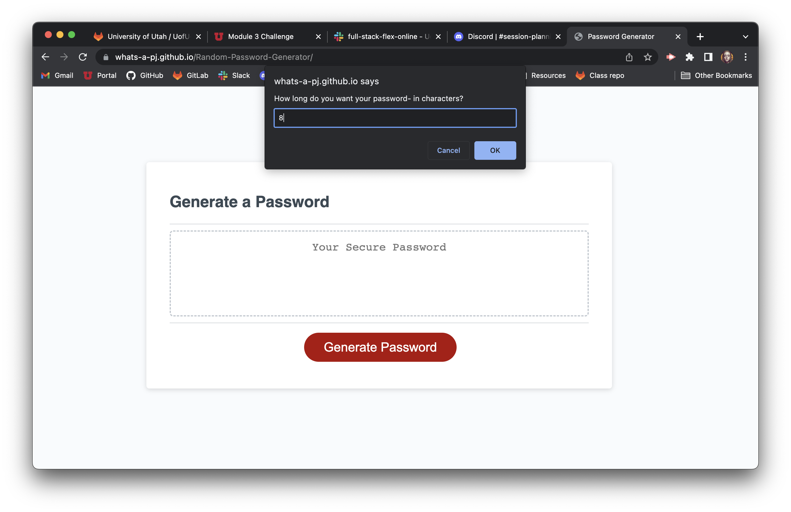
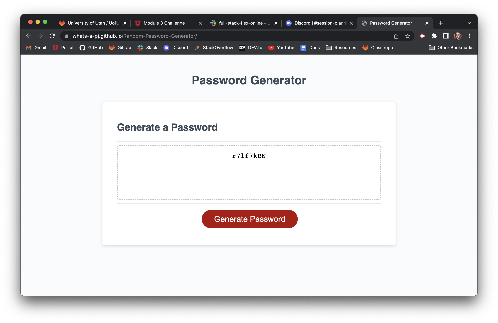

# Random-Password-Generator
## Why was this project created?
There are many uses for this application, maybe to subscribe to a newsletter, creating a customer account for an online store, or for something you won't need to log in to more than the initial login. This application creates a unique password that would be hard for someone- besides the user to guess.

## What does this application solve?
Users who can't come up with a brand new password of their own may find this application useful because all they have to do is set what preferences they want and then they can copy and paste the result into a "Sign-Up" page for any new website login. Most users tend to use the same one or two passwords across all applications because it is easy to remember; so this may come in handy when they need a login to be different from the rest and extra secure in comparison to other logins associated with their email/usernames.

## What this project has taught me
Even though we cloned a handful of lines of starter code, implementing what we learned about API's and Javascript turned out to be a bit of a challenge! I knew the functions and methods I needed to use and wrote them in the script.js file as soon as possible but it took me a few days to put everything in the correct sequence to make the application functional. I experimented with multiple if statements and for loops to get the result I wanted. What this project really taught me was that sometimes you just have to WRITE the code first and figure everything else out as soon as you have a foundation.

 Link to live site & screenshot 

https://whats-a-pj.github.io/Random-Password-Generator/

after you click generate password

after the first 4 prompts

result of choosing yes for all preferences and setting length to 8 characters

 Process Summary 

Created a clone with starter code and uploaded it locally

Wrote every function and method I possibly would use into the script.js file

Added 1 website to the README

Started a bit of research online and began bookmarking the websites used to add to the README later

Examined all the functions and methods I wrote into the script.js file and started adding properties and values and rearranging them in sequential order

Deleted excess variables I would not be using

Commented out functions and methods I could use for later

Researched .alert() method and while loops

Added .alert() to my window prompts in my if statements and a while loop if the user did not choose any security preferences

Committed changes and pushed to remote github repo as first draft

Indented the script.js file for readability and added descriptive comments

Had a study group on 7/2 and another in replacement of class time on 7/3

Updated README file

Moved the .addEventListener in the script.js file to see if it would effect how the application runs

Did not notice a change but moved the event listener back to the bottom of the page where it was before incase moving it did create a bug that I did not notice

Updated README file to add Process Summary, Link/screenshot to live site and Credits toggle lists

Committed changed and pushed to remote github repo

Deployed website to github pages

Added assets folder to hold screenshots of application

Added link to live site and screenshot of live site to README file

Pushed changes to remote repo

Added another note in the script.js file, committed changes remotely

Added to summary, committed changes one more time

 Credits 

I used this repo to clone the starter code

https://github.com/coding-boot-camp/friendly-parakeet

I used this website to help me create a professional README

https://coding-boot-camp.github.io/full-stack/github/professional-readme-guide

I used these websites to implement my functions and methods

https://www.w3schools.com/js/js_events.asp
https://www.w3schools.com/jsref/met_win_addeventlistener.asp
https://www.w3schools.com/jsref/met_win_alert.asp
https://www.w3schools.com/jsref/met_win_prompt.asp
https://www.w3schools.com/js/js_if_else.asp
https://developer.mozilla.org/en-US/docs/Web/JavaScript/Guide/Functions
https://developer.mozilla.org/en-US/docs/Web/JavaScript/Guide/Loops_and_iteration
https://developer.mozilla.org/en-US/docs/Web/JavaScript/Reference/Global_Objects/Math/floor
https://developer.mozilla.org/en-US/docs/Web/JavaScript/Reference/Global_Objects/Math/random
https://developer.mozilla.org/en-US/docs/Web/JavaScript/Reference/Statements/while
https://www.w3schools.com/js/js_loop_while.asp

I referenced our Javascript and Web API modules heavily to make sure I was setting everything up in a more legible way. I cross referenced the student activities with the websites I used for research to make sure I was using the proper syntax and to better understand what my methods and functions could do.

I had a study group on 7/2 and 7/3 with Brian Whisler, Jeremy Rapich, Salvador Mejia and Timothy Morgan. We talked about and ran through multiple ways we could accomplish the assignment, which we all found really interesting because we all achieved the same goal with similar ideas but drastically different code, which helped me personally, better understand what some of the functions and methods were doing and how I could implement those into my own script.js file. We also shared some website resources for independent research.

